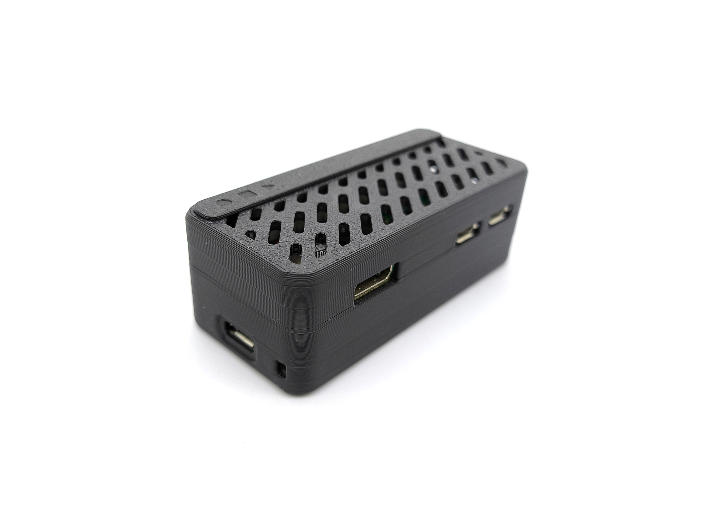
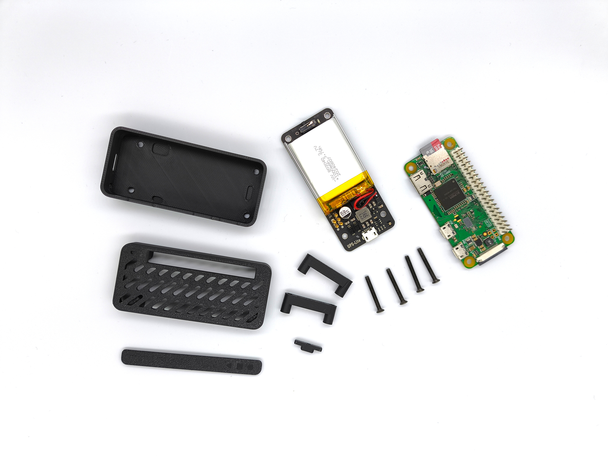

# UPS-Lite
UPS-Lite是一款专门为树莓派Zero所设计的UPS电源，采用一块1000mAh的聚合物锂电池进行供电，支持外部电源插入检测，支持边充边放，支持电池电量检测。

详细的使用说明请看项目文件中的使用说明文档。如有问题请联系我：416386001@qq.com

UPS-Lite is a UPS power supply specially designed for the Raspberry Pi Zero. It uses a 1000mAh polymer lithium battery for power supply, supports external power supply insertion detection, supports charging and discharging while supporting battery power detection. Support battery level detection.
 
For detailed instructions, please refer to the instructions in the project file. If you have any questions, please contact me: 416386001@qq.com

You can buy ups-lite from here   https://www.tindie.com/products/rachel/ups-lite-for-raspberry-pi-zero/

## Statement about fake UPS-Lite 
hello, first of all, thank you for your support of ups-lite. Recently, I have received feedback from many customers, they bought fake ups-lite, there are many problems, some can not read the accurate battery power value, some battery bulge phenomenon, and some serious damage to pi zero. If you buy a ups-lite like this picture, it says "Designed BY MJ" on the back, then it is a fake ups-lite, and it is recommended to stop using it for safety.

# Case for UPS-Lite 
https://makerworld.com.cn/zh/models/767038#profileId-734749

